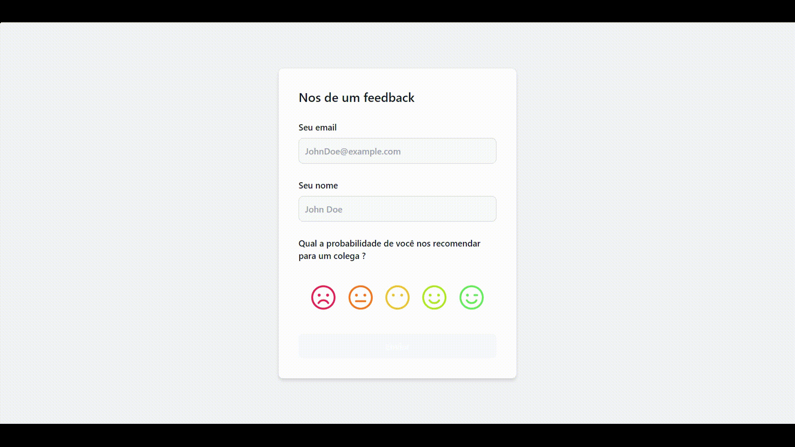

# Sistema de Net Promoter Score

Essa é uma API real de armazenamento de informações e coleta feedbacks de usuários.
A API também retorna os valores do calculo NPS.

# 🔖 Sumário

- [🚀 Começando](#começando)
- [📋 Pré-requisitos](#pré-requisitos)
- [🔧 Instalação](#instalação)
- [⚙️ Executando os testes](#executando-os-testes)
- [🛠️ Construído com](#construído-com)
- [🎥 Imagens](#imagens)
- [📌 Versão](#versão)

<div id='começando'/> 

## 🚀 Começando

Essas instruções permitirão que você obtenha uma cópia do projeto em operação na sua máquina local para fins de desenvolvimento e teste.

No terminal e de preferência na mesma pasta, clone o repositório:

```sh
git clone git@github.com:Raph2ll/Sistema-NPS.git
```

<div id='pré-requisitos'/>

### 📋 Pré-requisitos

Você ira precisar dessas tecnologias na sua máquina.

```sh
[Javascript, NPM, Docker*, Node.js, MongoDB, Git e GitHub]
```

<div id='instalação'/>

### 🔧 Instalação

Após baixar o repositório você vai precisar.

1. Entrar na pasta do repositório clonado:

```sh
cd Sistema-NPS
```

2. Caso você não tenha inicializado o MongoDB, você pode executar esse comando no docker:

```sh
docker run -v ~/docker --name mongodbNPS -p 27017:27017 -d mongo
```

3. Instale as dependências:

```sh
npm install && npm run buildAll
```

4. Inicie a aplicação:

```sh
npm start
```

5. Agora é só entrar no endereço do local host:

```sh
http://localhost:5173
```

<div id='executando-os-testes'/> 

## ⚙️ Executando os testes

### 🔩 Analise os testes de ponta a ponta

Esses testes foram feitos para testar os resultados dos end-points da aplicação.

Para executar os testes basta seguir os passos.

1. Entrar na pasta do projeto:

```sh
cd Sistema-NPS
```

2. Caso você não tenha inicializado o MongoDB, você pode executar esse comando no docker:

```sh
docker run -v ~/docker --name mongodbProducts -p 27017:27017 -d mongo
```

3. Inicializar os testes:

```sh
npm test
```

### ⌨️ Testes de estilo de codificação

Encontra e corrije problemas no código, relacionado a indentação e sintaxe.

ESLint:
```
npm run eslint
```

### 🗺️ Documentação

Com a aplicação já em execução, acesse a documentação em seu navegador pela URL http://localhost:3000/api-docs.

<div id='construído-com'/>

## 🛠️ Construído com

Ferramentas utilizadas para criar o projeto:

- **Linguagem:** 
  - [JavaScript](https://www.javascript.com)

 - **Frontend**: 
    - [React.Js](https://pt-br.reactjs.org) - Framework Web
    - [Vite](https://vitejs.dev) - Ferramenta de Desenvolvimento
    - [Tailwind](https://tailwindcss.com) - Framework de Estilização CSS
    - [Postcss](https://postcss.org) - Uma ferramenta para transformar CSS com JavaScript
    - [Eslint](https://eslint.org) - Linter de manutenção de código
    - [Axios](https://axios-http.com/ptbr/docs/intro) - Ajuda a consumir API's
    - [Phosphor-Icons](https://phosphoricons.com) - Icones

 - **Backend:**
    - [Express](https://expressjs.com/pt-br/) Framework para modelagem da API
    - [Swagger](https://swagger.io) - Documentação da API
    - [Node.js](https://nodejs.org/en/) - Ambiente de execução JavaScript
    - [Cors](https://developer.mozilla.org/pt-BR/docs/Web/HTTP/CORS) - Utilizado para cruzar rotas
    - [Date-fns](https://www.npmjs.com/package/date-fns) - Utilizado para manipualr datas
    - [JOI](https://joi.dev) - Validação de Schemas

  - **Banco de dados:**
    - [MongoDB](https://www.mongodb.com) - Banco NoSQL

  - **Ferramentas:**
    - [Insomnia](https://insomnia.rest/download) - Ferramenta de teste e desenvolvimento de API's

<div id='imagens'/>

## 🎥 Imagens

### Imagens do projeto 



>  Gif do projeto funcionando.


> Imagem dos testes.


> Documentação da aplicação.

<div id='versão'/>

## 📌 Versão

Utilizei [NPM](https://www.npmjs.com) :package: para controle de versão das dependências.

---
⌨️ com ❤️ por [Raphael](https://github.com/Raph2ll)
